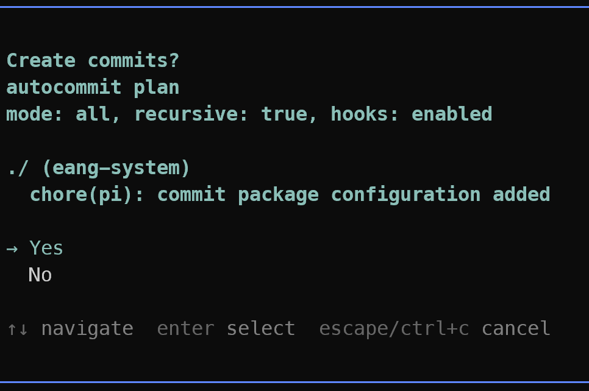

# pi-commit

A [pi](https://github.com/earendil-works/pi) extension for automatic, changelog-friendly Conventional Commits.



`/autocommit` inspects git changes, commits dirty submodules deepest-first, generates a Conventional Commit message with an isolated model, previews/confirms in interactive mode, and runs `git commit` with hooks enabled by default.

## Installation

```bash
pi install npm:@eamode/pi-commit
# or, for a project-local install committed in .pi/settings.json:
pi install -l npm:@eamode/pi-commit
```

Reload pi if it is already running:

```txt
/reload
```

## Usage

```txt
/autocommit
```

Default behavior: `/autocommit --all --recursive --context recent`

```txt
/autocommit --staged              # commit only staged changes
/autocommit --all                 # stage all changes before committing
/autocommit --recursive           # include nested submodules
/autocommit --no-recursive        # only commit the current/root repo
/autocommit --dry-run             # preview without staging or committing
/autocommit --no-verify           # bypass git hooks intentionally
/autocommit --model <provider/model>
/autocommit --model=<provider/model>
/autocommit --context none|recent|session
/autocommit --yes                 # skip confirmation prompts
```

If hooks fail, `/autocommit` stops and shows their output. Use `--no-verify` only when you intentionally want to bypass hooks.

## Configuration

Optional `.pi-commit.json` in the working directory. It is parsed as JSONC, so `//` comments and trailing commas are allowed. Command flags override config values for one run.

Start from the included example if desired:

```bash
cp .pi-commit.example.json .pi-commit.json
```

```jsonc
{
  // Model used to generate commit messages. Omit to inherit the current pi model.
  "model": "openai-codex/gpt-5.4-mini",
  // "staged" commits only staged changes; "all" stages all changes first.
  "defaultMode": "all",
  // Commit dirty nested submodules before the parent repository.
  "recursive": true,
  // Conversation context for message generation: "none", "recent", or "session".
  "contextMode": "recent",
  // Number of latest user prompts included when contextMode is "recent".
  "recentPromptCount": 5,
  // Maximum conversation context size passed to the message generator.
  "maxContextBytes": 8000,
  // Maximum staged diff size passed to the message generator for each repository.
  "maxDiffBytes": 30000,
  // Ask before creating commits in interactive UI mode. false behaves like --yes.
  "confirmBeforeCommit": true,
}
```

| Key | Values | Default | Description |
| --- | --- | --- | --- |
| `model` | pi model id, e.g. `openai-codex/gpt-5.4-mini` | current pi model | Model for commit-message generation. Use `openai-codex/...` for ChatGPT Plus/Pro login, or `openai/...` with an OpenAI API key. If unset, generation uses the current parent pi model; if unavailable or failed, a deterministic fallback message is used. |
| `defaultMode` | `"staged"` or `"all"` | `"all"` | `"staged"` commits already staged changes; `"all"` stages tracked and untracked changes before committing. |
| `recursive` | boolean | `true` | Commit dirty nested submodules before the parent repo. |
| `contextMode` | `"none"`, `"recent"`, or `"session"` | `"recent"` | Prompt context included in generation; `"session"` uses all available user prompts up to `maxContextBytes`. |
| `recentPromptCount` | number | `5` | Latest user prompts included when `contextMode` is `"recent"`. |
| `maxContextBytes` | number | `8000` | Maximum conversation context passed to the generator. |
| `maxDiffBytes` | number | `30000` | Maximum staged diff passed to the generator per repo. |
| `confirmBeforeCommit` | boolean | `true` | Ask before committing in interactive UI mode; `false` behaves like `--yes`. |

## Commit messages and submodules

Messages use Conventional Commits for future changelog generation: accurate types (`feat`, `fix`, `refactor`, `docs`, `chore`, etc.), meaningful scopes, subjects usually under 90 chars and capped around 120, non-imperative descriptions of what changed, and optional bodies for motivation/impact.

Example:

```txt
feat(autocommit): nested submodule commits generated deepest-first

Recursive dirty-repo discovery was added so submodules are committed before
the superproject and parent gitlink updates are captured correctly.
```

Nested repositories are committed deepest-first:

```txt
nested submodule -> submodule -> parent repository
```

## Development and release

TypeScript extension files are loaded directly by pi; no compile or bundle step is required.

```bash
npm install
npm run typecheck
npm run pack:dry-run
```

Releases use [semantic-release](https://semantic-release.gitbook.io/) from Conventional Commits on `main` and publish to npmjs. Before releasing locally, log in to npmjs for `@eamode` or export `NPM_TOKEN`, ensure `main` is clean/up to date, then run:

```bash
git checkout main
git pull --ff-only
npm ci
npm run typecheck
npm run release:dry-run
npm run release
```

`npm run release` runs `semantic-release --no-ci`, computes the next version, creates the git tag, and publishes `@eamode/pi-commit`.

See [`plans/autocommit-extension-plan.md`](plans/autocommit-extension-plan.md) for design notes.
