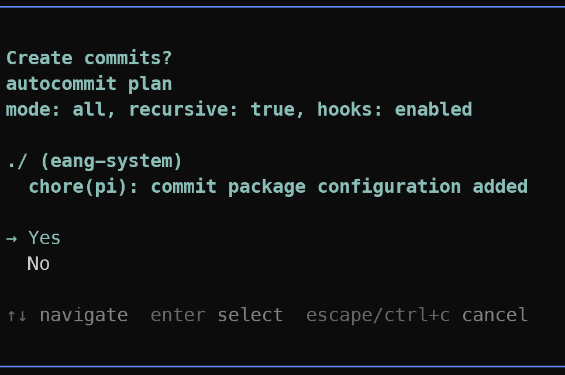

# pi-commit

A [pi](https://github.com/earendil-works/pi) extension for automatic, changelog-friendly Conventional Commits.

`/autocommit` inspects git changes, commits dirty submodules deepest-first, generates a Conventional Commit message with the configured/current model, previews/confirms in interactive mode, and runs `git commit` with hooks enabled by default.



## Installation

```bash
pi install npm:@eamode/pi-commit
# or, for a project-local install committed in .pi/settings.json:
pi install -l npm:@eamode/pi-commit
```

Reload pi if it is already running:

```txt
/reload
```

## Usage

```txt
/autocommit
```

Default behavior: `/autocommit --all`

```txt
/autocommit --staged              # commit only staged changes
/autocommit --all                 # stage all changes before committing
/autocommit --dry-run             # preview without staging or committing
/autocommit --no-verify           # bypass git hooks intentionally
/autocommit --model <provider/model>
/autocommit --model=<provider/model>
/autocommit --message-timeout 15000
/autocommit --max-diff-bytes 0    # omit full diffs from message generation
/autocommit --profile             # include timing breakdown
/autocommit --yes                 # skip confirmation prompts
/autocommit --thinking-level high # set model thinking effort
```

If hooks fail, `/autocommit` stops and shows their output. Use `--no-verify` only when you intentionally want to bypass hooks.

## Configuration

Optional `.pi-commit.json` in the working directory. It is parsed as JSONC, so `//` comments and trailing commas are allowed. Command flags override config values for one run.

Start from the included example if desired:

```bash
cp .pi-commit.example.json .pi-commit.json
```

```jsonc
{
  // Model used to generate commit messages. Omit to inherit the current pi model.
  "model": "openai-codex/gpt-5.4-mini",
  // Maximum time to wait for AI message generation before falling back. Set 0 to disable.
  "messageTimeoutMs": 45000,
  // "staged" commits only staged changes; "all" stages all changes first.
  "defaultMode": "all",
  // Maximum staged diff size passed to the message generator for each repository. Set 0 to omit full diffs.
  "maxDiffBytes": 30000,
  // Ask before creating commits in interactive UI mode. false behaves like --yes.
  "confirmBeforeCommit": true,
  // Include a timing breakdown in autocommit output.
  "profile": false,
  // Thinking/reasoning effort for the model. "off" disables thinking (fastest/cheapest).
  // Use "low"-"max" for more deliberate message generation.
  "thinkingLevel": "off",
  // Optional complete system prompt override. Omit or leave blank to use the built-in default.
  // See .pi-commit.example.json for the full default prompt to customize.
}
```

| Key | Values | Default | Description |
| --- | --- | --- | --- |
| `model` | pi model id, e.g. `openai-codex/gpt-5.4-mini` | current pi model | Model for commit-message generation. Use `openai-codex/...` for ChatGPT Plus/Pro login, or `openai/...` with an OpenAI API key. If unset, generation uses the current parent pi model; if unavailable, failed, or timed out, a deterministic fallback message is used. |
| `messageTimeoutMs` | number | `45000` | Maximum time to wait for AI message generation before falling back; `0` disables the timeout. |
| `defaultMode` | `"staged"` or `"all"` | `"all"` | `"staged"` commits already staged changes; `"all"` stages tracked and untracked changes before committing. |
| `maxDiffBytes` | number | `30000` | Maximum staged diff passed to the generator per repo; `0` omits full diffs and uses file names plus diff stat. |
| `confirmBeforeCommit` | boolean | `true` | Ask before committing in interactive UI mode; `false` behaves like `--yes`. |
| `profile` | boolean | `false` | Include a timing breakdown in autocommit output. Fallback reasons are shown whenever AI generation falls back. |
| `thinkingLevel` | `"off"`, `"minimal"`, `"low"`, `"medium"`, `"high"`, `"xhigh"`, `"max"` | `"off"` | Thinking/reasoning effort for the model. `"off"` disables extended thinking for fastest, cheapest generation. Higher levels make the model reason more before composing the commit message, which can improve quality for complex changes but increases token usage and latency. |

| `prompt` | string | built-in system prompt | Replaces the entire commit-generation system prompt for every repository processed in this run. Omitted or blank strings use the built-in default. Generated messages still undergo Conventional Commit validation. |

The full default prompt is included in `.pi-commit.example.json`; edit its `prompt` value to customize it. JSON strings encode newlines as `\n`. Custom prompts are used verbatim, without appended built-in instructions. Repository metadata and staged changes are still supplied separately in the user message. This is a config-only setting; no `--prompt` flag or file-path expansion is supported.

Generation uses provider/SDK token defaults. There is no total message character cap or shortening pass; `messageTimeoutMs` still controls the timeout.

## Commit messages and submodules

If model output lacks a valid Conventional Commit header, its description is preserved under a conservative `chore` prefix, with the fallback reason still shown. Long descriptions are retained in full in the body. The common `deps:` prefix is repaired to `chore(deps):`. The generic `repository changed` fallback is used when no usable model text is available (for example, an error or timeout).

Messages use Conventional Commits for future changelog generation: accurate types (`feat`, `fix`, `refactor`, `docs`, `chore`, etc.), meaningful scopes, first lines usually under 90 chars and at most 120, concrete descriptions of what changed (imperative phrasing is allowed), and optional bodies for motivation/impact.

Example:

```txt
feat(autocommit): nested submodule commits generated deepest-first

Recursive dirty-repo discovery was added so submodules are committed before
the superproject and parent gitlink updates are captured correctly.
```

Nested repositories are committed deepest-first:

```txt
nested submodule -> submodule -> parent repository
```

## Development and release

TypeScript extension files are loaded directly by pi; no compile or bundle step is required.

```bash
npm install
npm run typecheck
npm run pack:dry-run
```

Releases use [semantic-release](https://semantic-release.gitbook.io/) from Conventional Commits on `main` and publish to npmjs. `CHANGELOG.md` is maintained manually. Before releasing locally, log in to npmjs for `@eamode` or export `NPM_TOKEN`, ensure `main` is clean/up to date, then run:

```bash
git checkout main
git pull --ff-only
npm ci
npm run typecheck
npm run release:dry-run
npm run release
```

`npm run release` runs `semantic-release --no-ci`, computes the next version, creates the git tag, and publishes `@eamode/pi-commit`.
